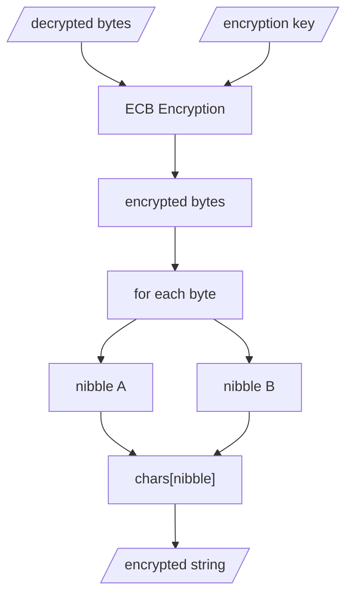
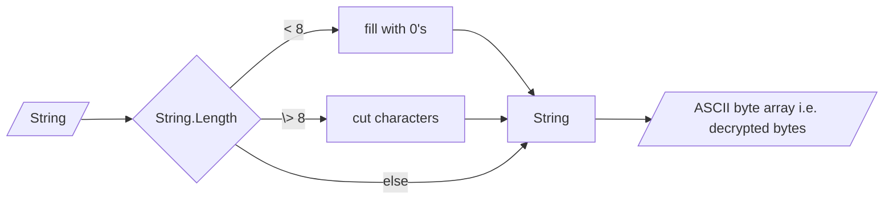

## Brief backstory
Dating almost a decade ago when I still was dealing with end-user support I wrote a batch script to install and uninstall a Tight VNC server service with a configuration of my own. Sadly VNC passwords are pretty weak as they are only up to 8 characters long and are only obfuscated not encrypted. I'm in no way ecouraging anyone to use it in a production environment. However I find it a good last resort solution if I have to support industry production machines running Windows with only touchscreen HIDs.

Since the configuration I was deploying along side the binary was always the same I wanted to randomize it during installation, however my skills were insufficient back then.

Although not particularly needed today, I wanted to revisit this old idea and use PowerShell to encrypt and decrypt VNC passwords.

## Building a script
VNC Passwords use electronic codebook encription (ECB) which is a mode of Data Encription Standard (DES) dating back to 1975. Thankfully this is fully implemented by `System.Security.Cryptography.DESCryptoServiceProvider` hence there is no need to code this part. Now ECB requires a set of decrypted bytes and an encryption key and it will return a different set of bytes. Each byte is then split into two nibbles (4-bits). A nibble can have a value between 0-15. Then each nibble is used to read a char from 0 to F.



### Proper string input
Altough applications accept vnc passwords up to 8 characters long the actual password length is always exactly 8 characters. The obvious question is what happens when it's longer or shorter.

After some research I established the missing characters are treated as `0` and any additional character above 8 chars is discarded.

Hence we've got our first bit of code.
```powershell
if ($String.Length -gt 8)
{
    $String = $String.Substring(0,8)
}
if ($String.Length -lt 8)
{
    $String = $String.PadRight(8,"0")
}
```
Here I asked myself if I should just use PowerShell's builtin parameter validation. Since I want to mimic existing GUIs I need to allow shorter and longer passwords and later modify them hence using `[ValidateLength(8)]` wouldn't be appropriate here.

### Encryption key with reverse bit order
Apparently all the major VNC providers i.e. UltraVNC, TightVNC, and TigerVNC use the same preshared encryption key. That's probably for compatibility reasons and/or standardisation.

Non the less the key is `23, 82, 107, 6, 35, 78, 88, 7` but it is actually later transformed before usage. Each byte has it's bits reversed. I *could* hardcode the already transformed byte array but since that is the preshared key I wanted to use the core value, not a transformed one.

```powershell
# Preshared key used by UltraVNC, TightVNC, and TigerVNC
[byte[]] $key = [byte[]] @(23, 82, 107, 6, 35, 78, 88, 7)
# Reverse bit order in key bytes
# i.e. 00010111 -> 11101000
for ($i=0;$i -lt 8; $i++) {
    $key[$i] = 
        (($key[$i] -band 0x01) -shl 7) -bor # 00000001 -> 10000000
        (($key[$i] -band 0x02) -shl 5) -bor # 00000010 -> 01000000
        (($key[$i] -band 0x04) -shl 3) -bor # 00000100 -> 00100000
        (($key[$i] -band 0x08) -shl 1) -bor # 00001000 -> 00010000
        (($key[$i] -band 0x10) -shr 1) -bor # 00010000 -> 00001000
        (($key[$i] -band 0x20) -shr 3) -bor # 00100000 -> 00000100
        (($key[$i] -band 0x40) -shr 5) -bor # 01000000 -> 00000010
        (($key[$i] -band 0x80) -shr 7)      # 10000000 -> 00000001
}
```

### ECB Encryption
Finally I can create a DES provider using ECB. VNC's ECB doesn't use any input vectors (IV) as an additionaly security measure, hence why we set it to `$null`. Since ECB is simmetric the out will be of the same length as input i.e. 8-byte array.
```powershell
[byte[]] $encArr = [byte[]]::new(8)
$DataEncryptionService = [System.Security.Cryptography.DESCryptoServiceProvider]::new()
$DataEncryptionService.Padding = "None"
$DataEncryptionService.Mode = "ECB"
$Encryptor = $DataEncryptionService.CreateEncryptor($key,$null)
[void] $Encryptor.TransformBlock($decArr,0,$decArr.Length,$encArr,0)
```

### Outputing encrypted bytes
Now although we have the same ammount of bytes the output actually has 16 characters. That's because each byte has to be split into 4-bit chunks (nibbles). First nibble should have bits from 5 to 8, the seccond from 1 to 4. Since later these will be cast to `[int]` to find proper char from a char array it doesn't have to be actually a 4-bit value. That's why for the first value i shift 4 bits to the right, and for the seccond value i zero the latter bits. Both values are used to read the proper character.

Yes, this is just converting binary to hex chars but this seemed way cleaner than using two conversions for each nibble (four for each byte).
```powershell
[char[]] $chars = [char[]] "0123456789ABCDEF"

[string] $VNCString = [string]::Empty
for ($i = 0; $i -lt $encArr.Length; $i++) {
    # Shift right 4 bits
    # i.e. 00010111 -> 00000001
    $VNCString += $chars[$encArr[$i] -shr 4]

    # Clear first 4 bits
    # i.e. 00010111 -> 00000111
    $VNCString += $chars[$encArr[$i] -band 0xf]
}

return $VNCString.Trim().ToLower()
```

## Final script
### Encryption - ConvertTo-VNCString.ps1
```powershell
[CmdletBinding()]
param(
    [Parameter(Mandatory,ValueFromPipeline)]
    [string]
    $String
)

if ($String.Length -gt 8)
{
    $String = $String.Substring(0,8)
}
if ($String.Length -lt 8)
{
    $String = $String.PadRight(8,"0")
}

# Preshared key used by UltraVNC, TightVNC, and TigerVNC
[byte[]] $key = [byte[]] @(23, 82, 107, 6, 35, 78, 88, 7)
[byte[]] $decArr = [System.Text.ASCIIEncoding]::new().GetBytes($String)
[byte[]] $encArr = [byte[]]::new(8)
[char[]] $chars = [char[]] "0123456789ABCDEF"

# Reverse bit order in key bytes
# i.e. 00010111 -> 11101000
for ($i=0;$i -lt 8; $i++) {
    $key[$i] = 
        (($key[$i] -band 0x01) -shl 7) -bor # 00000001 -> 10000000
        (($key[$i] -band 0x02) -shl 5) -bor # 00000010 -> 01000000
        (($key[$i] -band 0x04) -shl 3) -bor # 00000100 -> 00100000
        (($key[$i] -band 0x08) -shl 1) -bor # 00001000 -> 00010000
        (($key[$i] -band 0x10) -shr 1) -bor # 00010000 -> 00001000
        (($key[$i] -band 0x20) -shr 3) -bor # 00100000 -> 00000100
        (($key[$i] -band 0x40) -shr 5) -bor # 01000000 -> 00000010
        (($key[$i] -band 0x80) -shr 7)      # 10000000 -> 00000001
}

# Encrypt using electronic codebook (ECB) data encryption standard (DES)
$DataEncryptionService = [System.Security.Cryptography.DESCryptoServiceProvider]::new()
$DataEncryptionService.Padding = "None"
$DataEncryptionService.Mode = "ECB"
$Encryptor = $DataEncryptionService.CreateEncryptor($key,$null)
[void] $Encryptor.TransformBlock($decArr,0,$decArr.Length,$encArr,0)

# Split each byte into two nibbles, and
# write them as hex decimals
[string] $VNCString = [string]::Empty
for ($i = 0; $i -lt $encArr.Length; $i++) {
    # Shift right 4 bits
    # i.e. 00010111 -> 00000001
    $VNCString += $chars[$encArr[$i] -shr 4]

    # Clear first 4 bits
    # i.e. 00010111 -> 00000111
    $VNCString += $chars[$encArr[$i] -band 0xf]
}

return $VNCString.Trim().ToLower()
```
### Decryption - ConvertFrom-VNCString.ps1
```powershell
[CmdletBinding()]
param(
    [Parameter(Mandatory,ValueFromPipeline)]
    [string]
    $String
)

# Preshared key used by UltraVNC, TightVNC, and TigerVNC
[byte[]] $key = [byte[]] @(23, 82, 107, 6, 35, 78, 88, 7)
[byte[]] $decArr = [byte[]]::new(8)
[char[]] $chars = [char[]] "0123456789ABCDEF"

# Reverse bit order in key bytes
# i.e. 00010111 -> 11101000
for ($i=0;$i -lt 8; $i++) {
    $key[$i] = 
        (($key[$i] -band 0x01) -shl 7) -bor # 00000001 -> 10000000
        (($key[$i] -band 0x02) -shl 5) -bor # 00000010 -> 01000000
        (($key[$i] -band 0x04) -shl 3) -bor # 00000100 -> 00100000
        (($key[$i] -band 0x08) -shl 1) -bor # 00001000 -> 00010000
        (($key[$i] -band 0x10) -shr 1) -bor # 00010000 -> 00001000
        (($key[$i] -band 0x20) -shr 3) -bor # 00100000 -> 00000100
        (($key[$i] -band 0x40) -shr 5) -bor # 01000000 -> 00000010
        (($key[$i] -band 0x80) -shr 7)      # 10000000 -> 00000001
}

# Read each char as hex decimal representing a nibble, and
# join each two nibble's into one byte
$String = $String.ToUpper()
for ($i = 0; $i -lt $String.Length; $i += 2) {
    [byte[]] $encArr += [char](
        # Shift left 4 bits
        # i.e. 00010111 -> 01110000
        ($chars.IndexOf($String[$i]) -shl 4) -bor

        # Clear first 4 bits
        # i.e. 00010111 -> 00000111
        ($chars.IndexOf($String[$i+1]) -band 0x0f)
    )
}

# Decrypt using electronic codebook (ECB) data encryption standard (DES)
$DataEncryptionService = [System.Security.Cryptography.DESCryptoServiceProvider]::new()
$DataEncryptionService.Padding = "None"
$DataEncryptionService.Mode = "ECB"
$Decryptor = $DataEncryptionService.CreateDecryptor($key,$null)
[void] $Decryptor.TransformBlock($encArr,0,$encArr.Length,$decArr,0)

return [string]::new($decArr)
```
