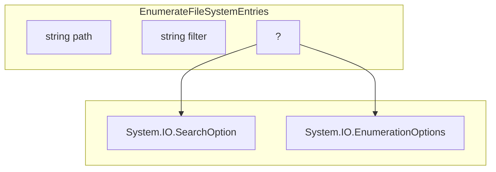

During one of my projects I had to enumerate milions of files. The sheer volume made the `Get-ChildItem` way too slow. What I needed was only file and directory paths for counting purposes and to find paths I can't enumerate.

## Idea
I've noticed that using `dir /b` in the old command prompt was few grades faster. I assumed that since `Get-ChildItem` returns an object for each file it uses more I/Os to gather all the data i.e. size, attributes, metadata and finally package it in an object. Since I didn't need this additional data I wanted to only enumerate paths using .Net. The method I settled on was `EnumerateFileSystemEntries`. This method returns strings as they come and for performance purposes we want to do the same hence we don't place each string in a `psobject` and we won't store them in an array but push them to stdout as they come.

## Method overloading

Firstly let's check how the method can overloaded. 

```powershell
> [System.IO.Directory]::EnumerateFileSystemEntries

OverloadDefinitions
-------------------
static System.Collections.Generic.IEnumerable[string] EnumerateFileSystemEntries(string path)
static System.Collections.Generic.IEnumerable[string] EnumerateFileSystemEntries(string path, string searchPattern)
static System.Collections.Generic.IEnumerable[string] EnumerateFileSystemEntries(string path, string searchPattern, System.IO.SearchOption searchOption)
static System.Collections.Generic.IEnumerable[string] EnumerateFileSystemEntries(string path, string searchPattern, System.IO.EnumerationOptions enumerationOptions)
```

Obviously the `string path` is needed. To use advanced options I can pass either `System.IO.SearchOption` or `System.IO.EnumerationOptions`. To use either of those a `string searchPattern` needs to be defined aswell.



Let's check their type.
```powershell
> [type] [System.IO.SearchOption]
  [type] [System.IO.EnumerationOptions]

IsPublic IsSerial Name                                     BaseType
-------- -------- ----                                     --------
True     True     SearchOption                             System.Enum
True     False    EnumerationOptions                       System.Object
```

`EnumerationOptions` is an object and gives the most flexibility. Let's dig in.

```powershell
> [System.IO.EnumerationOptions]::new()

RecurseSubdirectories    : False
IgnoreInaccessible       : True
BufferSize               : 0
AttributesToSkip         : Hidden, System
MatchType                : Simple
MatchCasing              : PlatformDefault
MaxRecursionDepth        : 2147483647
ReturnSpecialDirectories : False
```

Some of those options are good candidates for cmdlet parameters. By default it needs to not skip any attributes. Recursive is also definitely needed.

## Prototype
```powershell
# Future params
$Path = 'C:\'
$Filter = '*'
$AttributesToSkip = [System.IO.FileAttributes]::None
$Recurse = $true
$Depth = [int]::MaxValue

# Creating options object
$EnumerationOptions = [System.IO.EnumerationOptions] @{
    AttributesToSkip = $AttributesToSkip
    RecurseSubdirectories = $Recurse
    MaxRecursionDepth = $Depth
}

# Enumeration
[System.IO.Directory]::EnumerateFileSystemEntries($Path, $Filter, $EnumerationOptions)
```

Now lets turn this from a prototype script to a proper PowerShell cmdlet.

```powershell
function Get-FileSystemItemPaths {
    [CmdletBinding()]
    param (
        [Parameter(Mandatory=$true,
                   Position=0,
                   ValueFromPipeline=$true,
                   ValueFromPipelineByPropertyName=$true,
                   HelpMessage="Path to one or more locations.")]
        [Alias("PSPath")]
        [ValidateNotNullOrEmpty()]
        [string[]]
        $Path,

        [Parameter()]
        [string]
        $Filter = '*',

        [Parameter()]
        [switch]
        $Recurse,

        [Parameter()]
        [System.IO.FileAttributes]
        $AttributesToSkip = [System.IO.FileAttributes]::None,

        [Parameter()]
        [int]
        $Depth = [int]::MaxValue
    )

    begin {
        $EnumerationOptions = [System.IO.EnumerationOptions] @{
            AttributesToSkip = $AttributesToSkip
            RecurseSubdirectories = $Recurse
            MaxRecursionDepth = $Depth
        }
    }

    process {
        foreach ($Path in $PSBoundParameters['Path']) {
            $Path = Get-Item -Path $Path | ForEach-Object -MemberName FullName
            [System.IO.Directory]::EnumerateFileSystemEntries($Path, $Filter, $EnumerationOptions)
        }
    }

    end {}
}
```

Since we accept multiple paths by both the pipeline and via `-Path` parameter it needs to be in both a foreach loop and a process block. However i assume enumeration options would be the same for each use therefore I instantiate them only once in the begin block before each path is processed.

## Testing

Did dropping everything except paths result in faster performance? Here's the performance tests.

{: .w-75 .shadow .rounded-10 }